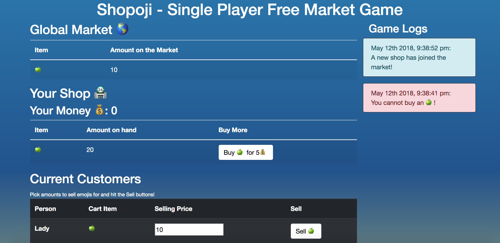

# Shopoji

**[Play it here!](https://a2lbkuyqj8.execute-api.us-east-2.amazonaws.com/Prod/)**

## About

Shopoji is a web game that runs in any browser. You sell your emoji stock to NPCs in the quest for more money.

As a unique twist, however, there is a free market. <!-- Prices are in flux due to supply and demand, and you need to account for that when pricing your inventory. -->

The market, in this case, is the other current players. The game itself is single player, but the market is controlled by the entire playerbase. <!-- You'll never interact with other players, but your pricing will affect their games as theirs will yours. Thus, you'll need strategy to make your emoji business the most thriving one in the market! -->

## How to Play

Once you enter the game, your initial inventory is all you'll have to work with. As more people enter the game after you, the difficulty ramps up as you'll need to make your emojis more enticing to your customers. 

The Messages on the right of the screen show the latest market events. It's limited to the most recent 5.     
The Global Market on the top of the screen gives you an idea for what emojis are scarce and which are in abundence (this may not line up with your shop's inventory -- that just means other people are playing!).     
The rest of the screen is around your shop itself -- your inventory and your customers. Sell emojis to make money for your shop! 

Each customer has a spot for you to name your price and a button to sell it to that person for that price. You can then use that money in your shop to increase your emoji inventory.

Objective: Have lots of money in your shop. There's no leaderboard -- just the endless quest for more money.

***

## Why was this game made?

This application was developed for two reasons: 1. to win a contest and 2. because I've always wanted a single player game like this.

The contest in question was sponsored by dev.to and the details can be found [here](https://dev.to/devteam/first-ever-dev-contest-build-a-realtime-app-with-pusher-4nhp). The only requirement was to use the Pusher real-time api.

The game I wanted was [Recettear](https://en.wikipedia.org/wiki/Recettear%3A_An_Item_Shop%27s_Tale) but with a "real" economy. Pusher's API seemed like a great way to pull that off, because it could handle the global market while I dealt with the actual single player gameplay.

## Tech Stack

* [Pusher API](https://pusher.com/)
* JavaScript
    * Node.js
    * jQuery
    * MomentJS
    * vanillaJS
* CSS
    * Bootstrap
* HTML
* [AWS CodeStar](https://aws.amazon.com/codestar/)
    * AWS CodePipeline
    * AWS CodeBuild
    * AWS CloudFormation
    * AWS Lambda
    * AWS S3
    * Probably more

### Dev Tools
* Github - [Source Code](https://github.com/ItsASine/shopoji)
    * The only thing needed locally is to run `npm i` to get the 1 dependency of the project: pusher
    * Also, you'll need to set up your own Pusher project to get credentials -- you all aren't getting my app secret and whatnot
* Webstorm IDE
* GitKracken

## Dev Blog

* May 5, 2018: [Pusher Shopkeep Game - Initial Idea](https://dev.to/itsasine/pusher-shopkeep-game---initial-idea-36po)
* May 6, 2018: [Pusher Project - Why I'll Never Be DevOps](https://dev.to/itsasine/pusher-project---why-ill-never-be-devops-520d)
* May 9, 2018: [Shopoji - Initial Front End With Working Effects!](https://dev.to/itsasine/shopoji---initial-front-end-with-working-effects-i56)
* May 12, 2018: [Shopoji - Pusher Presence Channels are cool](https://dev.to/itsasine/shopoji---pusher-presence-channels-are-cool-4nhg)
* May 13, 2018: Official Entry

## Roadmap

_Possible future features_

* Have your game more affected by other players
* Add more emojis to the marketplace with categories as well (food, tools, weapons, toys, etc)
* Add NPCs preferences for buying things. A knight might pay more for a :dagger: but won't be apt to pay all that much extra for a :balloon:
* Add market preferences for buying things. A scarce item will sell for more than an abundant one.